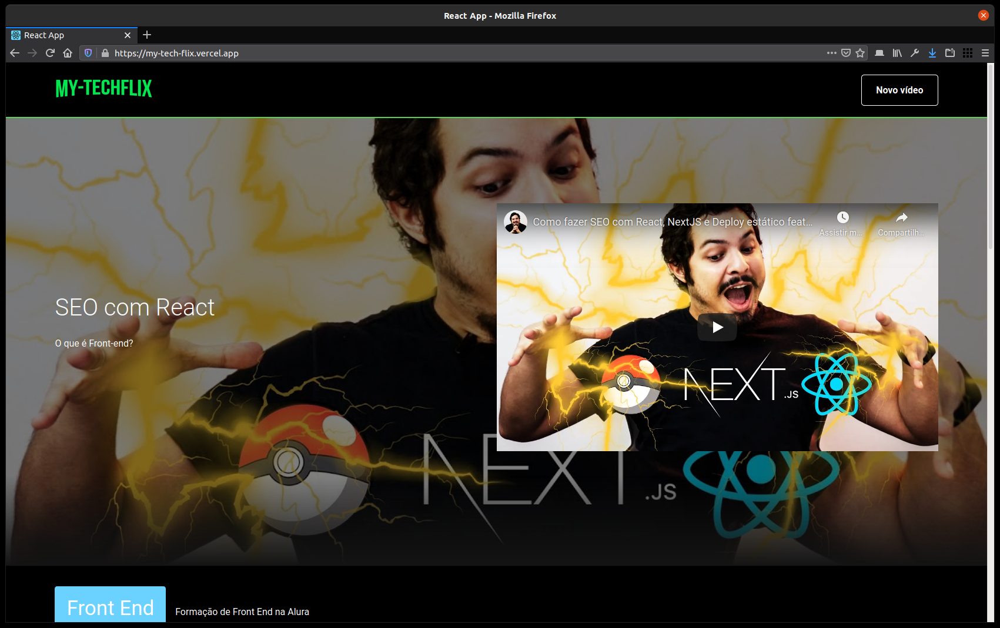

#	📽️	My-TechFlix

My-TechFlix is a project developed during **Alura's "React Immersion"**, with the objective of consolidating and improving knowledge about **Javascript**, **React**, **HTML** and **CSS**.

<p align="center">
  
</p>

---

##	📦	Install

To test this code, make a clone of this repository and then install it using:

```bash
$ git clone https://github.com/NanderSantos/My-TechFlix.git

$ cd My-TechFlix

$ npm install
```

Or just run this one-liner command and everything will be done:

```bash
$ git clone https://github.com/NanderSantos/My-TechFlix.git && cd My-TechFlix && npm install
```

---

##	🏃	Run

To run this project simply do:

```bash
$ npm start
```

---

##	🗄️	Hosting

The production version of this repo is available at: [My-TechFlix](https://my-tech-flix.vercel.app/)